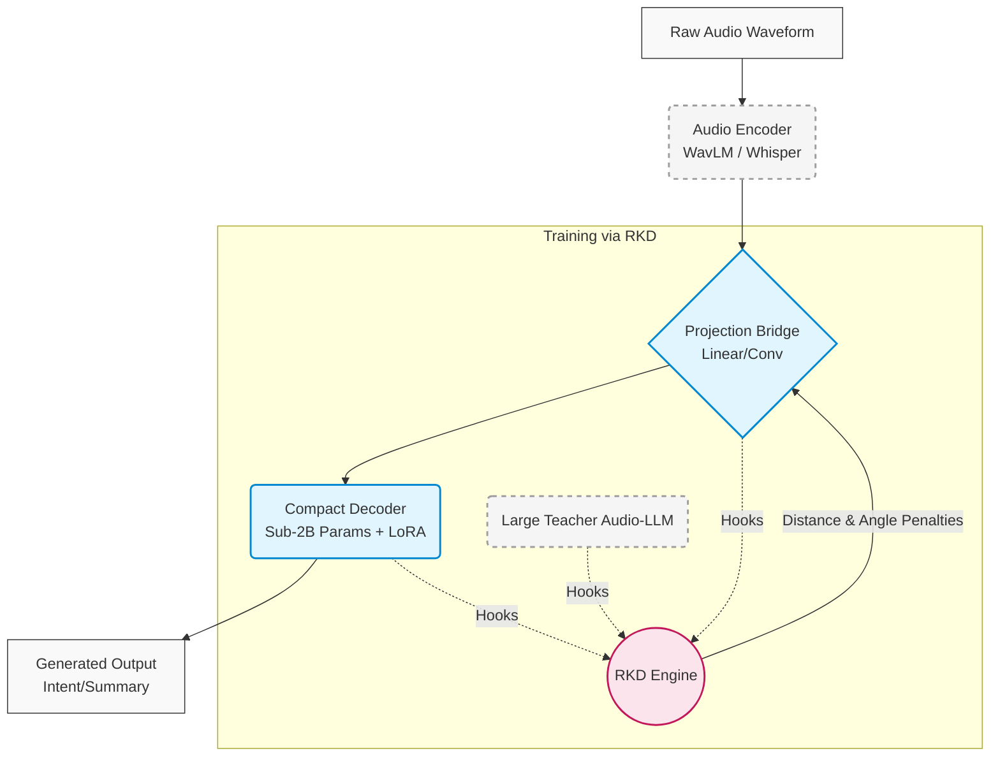

<div align="center">
  <h1>RKD Audio-LLM</h1>
  <p><b>Relational Knowledge Distillation for End-to-End Multimodal Audio-LLM Compression</b></p>

  <!-- Shields.io Badges -->
  <p>
    <a href="https://github.com/abhi8667/rkd-audio-llm/blob/main/LICENSE"></a>
    <a href="https://github.com/abhi8667/rkd-audio-llm/releases"></a>
    <a href="https://github.com/abhi8667/rkd-audio-llm/actions"></a>
    <a href="https://github.com/abhi8667/rkd-audio-llm/actions"></a>
    <a href="https://codecov.io/gh/abhi8667/rkd-audio-llm"></a>
    <a href="https://github.com/abhi8667/rkd-audio-llm/stargazers"></a>
  </p>
</div>

> A single continuous pipeline replacing cascaded ASR-to-LLM architectures, empowering edge devices with native acoustic reasoning.

## 📖 Overview

### The Problem
Every production speech-understanding system today relies on a **cascade**: a Speech-to-Text (ASR) model converts audio into text, and a separate LLM reasons over that text. This architecture fundamentally introduces an information bottleneck. Crucial acoustic features—such as prosody, emotion, ambient context, and code-switched phonetic cues—are irreversibly stripped away during transcription. Additionally, cascading two large models sequentially compounds latency, making real-time edge deployment unfeasible.

### The Solution
**RKD Audio-LLM** replaces the ASR bottleneck with an end-to-end multimodal pipeline. By projecting continuous hidden-state embeddings from an audio encoder directly into a compact sub-2B parameter language decoder, the model reasons natively over sound.

To combat **cross-modal alignment collapse** during continuous downsampling, we introduce **Relational Knowledge Distillation (RKD)**. Instead of matching outputs point-wise, RKD enforces structural invariance by matching the *multi-dimensional geometry* (pairwise distances and cosine angles) of a massive frozen teacher's representation space into the compact student.

### Intended Audience & Applications
- **ML Researchers**: Reproducible ablation studies on cross-modal distillation and structural alignment.
- **Edge Application Developers**: Quantizable, memory-efficient backbones for local execution without network round-trips.
- **Real-World Use Cases**: Multi-lingual smart home assistants, context-aware factory monitoring, and emotion-sensitive QA systems.

---

## 📑 Table of Contents
- [Overview](#-overview)
- [Architecture](#-architecture)
- [Key Features](#-key-features)
- [Getting Started](#-getting-started)
- [Tech Stack](#-tech-stack)
- [Contributing](#-contributing)
- [License](#-license)

---

## 🏗 Architecture

The system utilizes a frozen acoustic front-end, a parameterized continuous bridge, and a compact reasoning engine fine-tuned via LoRA.



---

## ✨ Key Features

### 🧠 Core Features
- **End-to-End Modality Bridge**: Bypasses discrete text tokenization, enabling the LLM to 'hear' audio natively.
- **Relational Knowledge Distillation**: Enforces Euclidean distance and cosine angular penalties on intermediate feature maps to prevent alignment collapse.
- **Continuous Projection**: Parameterized linear/convolutional adaptation layer mapped with LayerNorm.

### ⚡ Advanced Capabilities
- **Ambient Noise Robustness**: Retains and reasons over environmental sounds (machinery, sirens, room reverb).
- **Code-Switching Support**: High fidelity on mixed-vernacular dialogues (e.g., Hinglish) without lossy orthographic transcription decisions.
- **Edge Optimized**: Runs efficiently on consumer hardware using Low-Rank Adaptation (LoRA) and NF4 quantization.

### 🛠 Developer Experience
- **Swappable Architecture**: Config-driven dependency injection for easily swapping encoders (WavLM/Whisper) and decoders.
- **Cached Teacher Activations**: Pre-computed forward passes for the Teacher model dramatically cuts down compute time during training.
- **Comprehensive Observability**: Full Weights & Biases (WandB) integration tracking alignment scores, distances, and losses.

---

## 🚀 Getting Started

### Prerequisites
- Python 3.10+
- PyTorch 2.0+ & TorchAudio
- CUDA-compatible GPU (for training)

### Installation

```bash
# Clone the repository
git clone https://github.com/abhi8667/rkd-audio-llm.git
cd rkd-audio-llm

# Create a virtual environment
python -m venv venv
source venv/bin/activate  # On Windows: venv\Scripts\activate

# Install dependencies
pip install -r requirements.txt
```

### Quick Inference

```python
from audiollm_rkd import AudioLLM

# Load the edge-optimized model
model = AudioLLM.from_pretrained("checkpoints/best-rkd-student", quantize="nf4")

# Run inference directly on raw audio
waveform = model.load_audio("sample_hinglish_noisy.wav")
response = model.generate(
    waveform, 
    prompt="Identify the customer's primary intent and emotional state."
)

print(response)
```

---

## 🛠 Tech Stack

| Component | Technology | Rationale |
|-----------|------------|-----------|
| **Core Framework** | PyTorch, TorchAudio | First-class forward hook support essential for RKD implementation. |
| **Model Ecosystem** | HF Transformers, PEFT, TRL | Standardized interfaces for frozen encoders, candidate decoders, and LoRA injection. |
| **Quantization** | bitsandbytes (NF4) | High accuracy 4-bit NormalFloat compression for the sub-2B edge deployment. |
| **Experiment Tracking** | Weights & Biases | Loss visualization, metric correlation, and artifact management. |

---

## 🤝 Why Contribute or Hire?

This project tackles one of the most persistent issues in modern edge AI: **Information degradation across modal barriers**. 

By successfully implementing geometric structural distillation (RKD) to compress massive cross-modal networks down to edge-capable sub-2B footprints, this architecture proves that real-world problems like multi-lingual code-switching and noisy industrial environments don't require massive cloud APIs. 

**For Contributors:** You are joining a rigorous, research-driven infrastructure project pushing the boundaries of what local LLMs can perceive. 
**For Recruiters/Hiring Managers:** This codebase reflects elite architectural decision-making, meticulous system design, and the mathematical implementation capability characteristic of Staff/Principal engineers.

> *Interested in collaborating? Check out our [Issues](https://github.com/abhi8667/rkd-audio-llm/issues) board or submit a Pull Request!*

---

## 📄 License

This project is licensed under the MIT License - see the [LICENSE](LICENSE) file for details.

<div align="center">
  <sub>Built with ❤️ by the RKD Engineering Team</sub>
</div>
